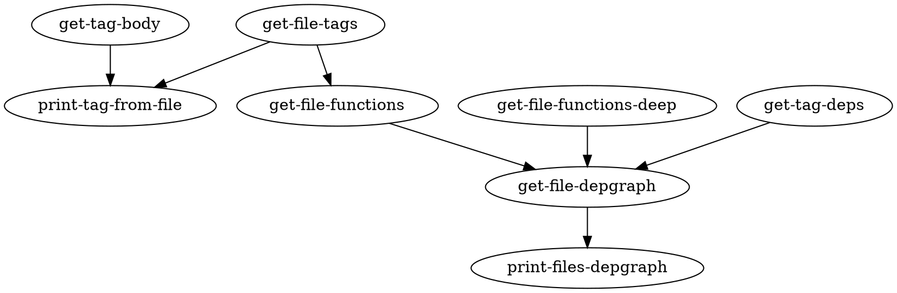

## Prelude

Языков для «создания» и «описания» изображений достаточно много.

Пробегусь по некоторым из них (это не исследование и не введение в
использование какого-то из них; это ~~teaser~~ слюнявка с линками для
дальнейшего изучения :-)

Упоминаются SVG, DOT, pic, METAPOST, TikZ, Sketch, Context Free Art.

## SVG

[SVG][] — универсальный язык для описания векторных изображений;
обладает возможностями анимации и различных эффектов. SVG — приложение
[XML][], поэтому для его создания и обработки пригодны традиционные
средства работы с зумелем. Представление находится на достаточно низком
уровне — «квадратик здесь, кружочек там».

Простой SVG-файл из квадратика и звёздочки выглядит так:

[![foo][]][]

То есть, так:

```xml
<?xml version="1.0" encoding="UTF-8" standalone="no"?>
<!-- Created with Inkscape (http://www.inkscape.org/) -->
<svg
   xmlns:svg="http://www.w3.org/2000/svg"
   xmlns="http://www.w3.org/2000/svg"
   version="1.0"
   width="177.16534"
   height="177.16534"
   id="svg2">
  <defs
     id="defs4" />
  <g
     id="layer1">
    <rect
       width="95.714287"
       height="70.714287"
       x="45.357143"
       y="77.522484"
       style="fill:#a40000"
       id="rect2160" />
    <path
       d="M 55.714285,80.022487 L 37.799451,79.466755 L 24.821318,91.828723 L 19.813862,74.618972 L 4.0464685,66.096093 L 18.866525,56.015614 L 22.099873,38.386217 L 36.266627,49.365889 L 54.032339,46.993202 L 47.967818,63.859491 L 55.714285,80.022487 z "
       style="fill:#204a87"
       id="path2253" />
  </g>
</svg>
```

Читать можно, но не нужно. Как и с большинством творений [W3C][], планов
уйма — [анимация][] или [фильтры][].

## DOT

[DOT][] — стандартный язык *описания* графов; используется в качестве
формата исходных файлов в программах проекта [Graphviz][]. В исходном
тексте описывается структура графа и некоторые аспекты визуального
оформления. Различные программы пакета Graphviz (такие как `dot(1)`,
`fdp(1)`, `neato(1)` и прочие) используют различные алгоритмы
изображения графовых структур, так что из одного описания на DOT
получаются разные картинки.

Изображение ниже получено при помощи `fdp(1)`:

[![grok-lisp.dot][]][]

Исходный файл этой картинки таков:



Как видно, здесь просто описано отношение, которое задаёт граф на
множестве вершин.

Graphviz нередко [используется][] для (в том числе *автоматизированной*
(как, кстати, было в случае картинки выше)) отрисовки коммуникационных
сетей, схем конечных автоматов или онтологий.

## pic

pic (ныне часть [groff][]) — простой миниязык для создания нехитрых
схем; много [сахара][] в «тему», из рассматриваемых языков программу на
этом можно действительно читать вслух:

    box width 1.5 "Install GNU/Emacs";
    arrow from last box.s down;
    box "Run it";
    arrow;
    ellipse dashed .05 "???";
    arrow;
    box thick 2 "PROFIT!";
    spline -> from last box.right right then up 2 to 2nd box.right;

    line dotted .02 from 1/5 of the way between last ellipse.bottom and last box.top left;
    ellipse width .5 height .35 dotted .02 "C-x C-e";

[![Profit with GNU Emacs (pic)][]][]

(Помните, ежедневное прочтение мантры «Emacs is my OS, Linux is my
device driver» укрепляет волосы и потенцию!)

Pic также поддерживает циклы и условные операторы, а также макросы. В
целом характер pic-программ более императивный, чем те же описания на
DOT.

Не могу не отметить превосходное руководство Эрика Реймонда «[Making
pictures with GNU PIC][]».

## METAPOST

[METAPOST][] — старейший и кошернейший графический язык, в первую
очередь предназначенный для использования вместе с TeX. Родным выходным
форматом для него является PostScript, хотя современные драйверы вывода
в TeX (например, `pdftex`) могут прозрачно включать изображения METAPOST
по одному лишь исходнику.

METAPOST обладает системой типов, свойственных изображениям, умеет
помимо обычного черчения выполнять различные преобразования над
элементами рисунка, находить точки пересечения кривых или на лету решать
линейные уравнения; в нём также есть средства создания макросов и много
чего ещё.

Вот простой пример рисунка, полученного в Metapost, это [модель Клейна в
круге][]:

[![Klein disk model (METAPOST)][]][]

А вот его код, демонстрирующий некоторые базовые возможности METAPOST.

    beginfig(1);
      D = 5cm;
      R = D/2;

      pair X, Y, A, B, M, N, P, O;
      path disk, chordA, chordB;
      O := (0, 0);
      X := dir(60)*R;
      Y := dir(200)*R;

      A = 3/10[Y, X];
      B = 1/5[X, Y];

      M := dir(280)*R;
      N := dir(330)*R;

      chordA := X--M;
      chordB := Y--N;

      P = chordA intersectionpoint chordB;

      disk := fullcircle scaled D;

      pickup pencircle scaled 0.7;
      draw X--Y;
      draw chordA;
      draw chordB;

      pair t;
      for i=1 upto 7:
        t := dir(-37+i*12)*R;
        draw t--3[t,P] withpen pencircle scaled 0.3;
      endfor;

      clip currentpicture to disk;

      draw disk withpen pencircle scaled 1;

      dotlabel.ulft("A", A);
      dotlabel.ulft("B", B);
      dotlabel.urt("X", X);
      dotlabel.llft("Y", Y);
      dotlabel.bot("M", M);
      dotlabel.lrt("N", N);
      dotlabel.lrt("P", P);
    endfig;
    end;

Важнейший плюс — с METAPOST легко использовать в пометках на рисунках те
же параметры шрифта, что и в остальном документе.

Для METAPOST существует целый ряд любопытных макрорасширений, которые
позволяют упростить изображение статистической информации (`mpgraph`),
[диаграмм Фейнмана][] ([feynmf][]), электрических схем ([mpcirc][]),
трёхмерностей ([FEATPOST][]) и [многого другого][].

Вряд ли нужно здесь писать много о METAPOST — Евгений Балдин написал
[хороший обзор][] возможностей METAPOST; качественным учебником по
инструменту является «[Learning METAPOST by doing][]».

## PGF и TikZ

Вновь TeX-средства! [PGF][] — пакет, определяющий команды для создания
изображений. PGF состоит из нескольких частей, работающих на разном
уровне представления, от драйвера вывода до команд пользователя. Из
доступных морд (front-end) функциональной является TikZ (*«TikZ ist kein
Zeichenprogramm» — «TikZ — не программа для рисования»* (ср. с *«GNU's
Not Unix»* )), конструкции которого собственно и позволяют описывать
графику.

Основным средством использования TikZ является окружение `tkzpicture`.
Собственно набор графических примитивов не так уж и отличается от
METAPOST: прямые, угловатые и скруглённые кривые, кружочки-эллипсы,
многоугольники.

Синтаксис тоже чем-то схож с META: например, в METAPOST «одна пятая
отрезка от точки A до точки B» — это `1/5[A,B]`, а в TikZ —
`($ (A)!.2!(B)$)`

Существует также понятие узлов — именованных частей рисунка с
соответствующей надписью, формой; интерес представлют средства
позиционирования узлов друг относительно друга и их связывания
стрелочками (см. [пример][] на [fauskes.net][]).

Чтобы не трепаться непрерывно на протяжении более четырёх абзацев,
привожу пример с картинкой. Guess what? Снова модель Клейна.
Практически то же самое, что в секции про METAPOST (сравните код!):

[![Klein disk model (TikZ)][]][]

[В коде][] видно использование пометок, полярных координат (систем
координат там много, можно даже свои вводить), пересечений прямых и
проведение окружности через точку, нехитрый цикл для проведения пачки
параллельных прямых:

```latex
\begin{tikzpicture}
  \coordinate [] (O) at (0, 0) {};

  \coordinate [label=above right:$X$] (X) at (60:1) {};
  \coordinate [label=below left:$Y$] (Y) at (200:1) {};

  \coordinate [label=above left:$A$] (A) at ($ (Y)!.3!(X)$) {};
  \coordinate [label=above left:$B$] (B) at ($ (X)!.2!(Y)$) {};

  \coordinate [label=below:$M$] (M) at (280:1) {};
  \coordinate [label=below right:$N$] (N) at (330:1) {};

  \coordinate [label=above left:$P$] (P) at (intersection of X--M and Y--N) {};

  % disk model
  \node [draw,thick,circle through=(X)] (circle) at (O) {};

  % chords
  \draw (X) --node[auto]{$l$} (Y);
  \draw (X) -- (M);
  \draw (Y) -- (N);

  % a bundle of parallel lines
  \begin{scope}
  \clip (O) circle(1);
  \foreach \a in {0,...,6} \draw[very thin]
                            ($ (P)+(180+\a*12:2) $) --
                            ($ (P)+(\a*12:2) $);
  \end{scope}

  %dot marks
  \foreach \p in {X, Y, A, B, P, M, N} \draw node[dot] at (\p) {};
\end{tikzpicture}
```

Ещё много функциональности вынесено в отдельные дополнения к PGF&TikZ.
Например, есть дополнения для рисования развёрток многогранников или
создания графиков.

Последнее особенно привлекательно — в пакете есть как встроенные (куцые)
средства черчения графиков функций, так и интерфейс к [gnuplot][]
(собственно `gnuplot(1)` обеспечивает нас лишь точками, по которым
средствами TikZ чертится кривая)! В такой конструкции команды в скобках
передаются напрямую в gnuplot:

    \draw plot function{set polar; set parametric; plot [0.54930615:3] asin(cosh(t)/(2*sinh(t))),t;};

В итоге и работает быстро, и выглядит красиво (только не забываем для
работы подчинённого процесса gnuplot приписывать «опасный» флаг
`--shell-escape` к вызову `pdflatex(1)` (или что у вас там)).

TikZ обладает прекрасной документацией в лице родного мануала (помимо
справочника, там есть 4 хороших туториала, так что научиться
использовать PGF/TikZ очень просто).

Напоследок, вот ещё одна моя картинка, [описанная][] на TikZ:

[![Klein &amp; Poincaré models (TikZ)][]][]

## Sketch

[Sketch][] вновь является приблудой под TeX. Программа `sketch(1)`
использует промежуточный миниязык для описания трёхмерных сцен, которые
транслируются в код TikZ или [pstricks][].

Используемые типы данных — точка (трёхмерная), вектор, скалярная
величина. Через точки можно проводить линии и натягивать на них
полигоны, а вектора служат при описании различных трансформаций, которые
можно накладывать на объекты.

В Sketch интересно из разных объектов путём повторного приложения
определённой трансформации получать фигуры высшей размерности.

Например, если взять точку `(0,5,0)` и вращать её с некоторым шагом α
вокруг вектора `[0,0,1]` в плоскости, перпендикулярной этому вектору,
соединяя последовательно её положения в пространстве, получим некоторую
аппроксимацию дуги. Если провращать дугу в 180° вокруг вектора,
соединяющего её концевые точки, на 360 градусов, получится сфера.

Для подобных операций в Sketch есть своя конструкция — `sweep`:

    sweep{n, T_1, ... ,T_k} M

Что означает — n раз применить к объекту `M` композицию трансформаций
`T_1, ... ,T_k`, соединить полученные на каждом шаге копии, создать
новый объект. Тип соединения зависит от типа объекта `M`, например, при
вращении точки копии соединяются прямой.

Вот небольшой пример, на котором изображены части сферы (задняя
полусфера и нижняя часть передней полусферы), каждая из которых получена
таким образом.

[![Sketch-generated][]][]

Каждая часть была нарисована в два шага — сначала вращением точки
получалась дуга, вращение которой уже давало соответствующую часть
сферы. На рисунке эта дуга выделена красным, как и вектор, вокруг
которого происходило второе вращение.

Код картинки, поясняющий сказанное:

    def N (0,5,0)
    def S (0,-5,0)

    def Oy [0,1,0]
    def Oz [0,0,1]

    def rots_z 30
    def rots_theta 25

    def back_hemisphere {
        sweep [cull=false, fill=orange!50, fill opacity=0.5] {rots_z, rotate(180 / rots_z, [Oy])}
              sweep[style=very thin] {rots_theta, rotate(180 / rots_theta, [Oz])} (S)
    }

    def edge {
        sweep[style=ultra thick, draw=red] {rots_theta, rotate(180 / rots_theta, [Oz]+[-0.01,0,0])} (S)
        line[arrows=*->,style=very thick,draw=red] (0,0) (0,6)
    }

    def lower_sphere {
        sweep [cull=false, fill=blue, fill opacity=0.5]{rots_z, rotate(180 / rots_z, [0,-1,0])}
              sweep[style=very thin]{rots_theta/2, rotate(90 / (rots_theta / 2))} (S)
    }

    def sphere {
         {back_hemisphere}
         {edge}
         {lower_sphere}
    }

    put { rotate(30, [1,0,0]) then rotate(30, [0,1,0]) } {sphere}

    global { language tikz }

Здесь в `sweep` используются преобразование `rotate`, поворачивающее
объект на указанный угол вокруг заданного направления относительно
заданной точки.

Стоит заметить полупрозрачную раскраску двух половинок — так как Sketch
сам ничего не рисует, а только генерирует команды TikZ или pstricks, в
его собственных конструкциях можно использовать параметры рисования
указанных пакетов, например `fill opacity=0.5` из TikZ (в примере выше
это почти все команды в квадратных скобочках).

Кривые пока (на июнь 2008) не реализованы.

Ещё в Sketch можно проецировать объекты на плоскости.

Нет смысла писать о Sketch здесь больше — в родном руководстве всё есть.

Небольшой [туториал][] есть вновь на [fauskes.net][].

## Context Free Art

Проект [Context Free Art][] использует истинно декларативный язык
описания графики CFDG (Context Free Design Grammar), построенный на
[контекстно-свободной грамматике][].

Изображение описывается как набор правил-[подстановок][], которые
раскрываются в другие правила и так далее (таким образом, при помощи
CFDG прекрасно описываются геометрические [фракталы][]). На каждом шаге
к элементам могут применяться геометрические преобразования и изменения
внешнего вида. Последовательность подстановок может прерваться по разным
причинам, например, если встретится одно из «концевых» встроенных правил
`CIRCLE`, `SQUARE` или `TRIANGLE`. В исходнике также указывается
подстановка, с которой следует начать генерацию рисунка.

Предыдущий абзац непонятен чуть менее, чем полностью, поэтому я поясню
на примере.

[Мышатки][] — милые мелкие грызуны. Любой школьник знает, что будет,
если мышей расположить в вершинах правильного n-угольника и заставить
каждую бежать с постоянной скоростью к правой соседке. В любой момент
времени [ситуация][] остаётся *одинаковой* для каждой из мышей, а
траекторией каждой из них будет логарифмическая спираль — одна из самых
эпичных спиралей. Если исходный n-угольник вращать против часовой
стрелки, одновременно уменьшая, его вершины и опишут искомые траектории.

Вот и фрактал выскочил — взять n-угольник, уменьшить, повернуть, процесс
повторить. Назовём его M и положим для простоты n равным 4. Тогда M —
это квадрат, в который вписан уменьшенный и повёрнутый M. На CFDG это
описание звучит так:

    startshape sq

    rule sq {
         SQUARE { sat 1 b 1 }
         sq {s .9 r 5 hue 10}
    }

Которое можно откомпилировать так (в `sq.cfs` лежит само описание):

    $ cfdg sq.cfs sq.png

И получить вот такую картинку (неплохо для описания на 4 строки!):

[![«4 (rasta)mice» (CFDG)][]][]

В самом описании понятно всё кроме содержимого фигурных скобочек.
Директива `startshape sq` призывает программу начать с правила `sq`,
`SQUARE { sat 1 b 1 }` — уже упомянутое встроенное правило рисования
квадратика (`sat 1 b 1` как бы говорит нам, что квадрат можно
раскрасить), которое не раскрывается ни в какое другое, а просто тупо
рисует квадрат (OMG THAT'S [SIDE-EFFECT][]!). Ссылка на `sq` внутри
описания самого `sq` намекает на былинную рекурсию.

В фигурных скобках после ссылки на другое правило (в этом случае — `{s
.9 r 5 hue 10}`) описываются преобразования *контекста* (в CFDG
абстрактное понятие грамматического контекста неплохо превращается в
знакомый многим по рисовальным тулкитам «графический контекст» (напр.
[Cairo][])), выполняемые до того, как система спустится на один
уровень вниз по последовательности раскрытия подстановок. `s .9`
сжимает до 90%, `r 5` поворачивает на 5 градусов, а `hue 10` для пущей
драмы сдвигает тон краски на 10 пунктов (см. цветовую модель [HSV][]).
Когда подстановка выполнится, правило `SQUARE` нарисует квадратик с
учётом уже этого изменённого контекста. И в то же время каждый шаг
подобен следующему (а с допущением об обратимости преобразований — и
предыдущему (если он есть (а если его не было, то цепочку для полноты
картины можно продолжить и в другую сторону))), а *правила
преобразования не изменяются при развитии контекста*. В этом и есть
суть контекстно-свободной грамматики.

Несложно заметить, что приведённое выше описание `sq` по-идее должно
бесконечно раскрываться само в себя, однако на практике этого не
происходит — когда результат очередной подстановки становится
незаметным, Context Free обрывает цепь. При этом учитывается указанное
при рендеринге разрешение. Например, по умолчанию (картинка 500×500)
`sq.cfs` приводит к рисованию 64 квадратиков, при размере 2000×2000 это
число возрастает, а детализация остаётся на высоком уровне.

Можно и искусственно ограничивать число подстановок параметром командой
строки `-m`.

В принципе описанных средств Context Free уже хватает для создания
просто [нереальных изображений][], хотя в [вики][] проекта рассказано о
ещё нескольких фишках.

А что если заставить точку пошагово двигаться в одном из восьми
возможных направлений? Добавив на каждом шаге смещение тона, получим вот
такую картинку (почти [броуновское движение][]):

[![Путешествия точки в цвете][]][]

Код прост, и вновь используются равновесные описания с одинаковыми
именами (регулируя вес разных экземпляров `move`, можно добиться общей
тенденции точки к движению в каком-то определённом направлении):

    startshape step

    background { b -1 }

    rule step
    {
        CIRCLE { sat 1 s 1 }
        move { b .01 hue .005 }
    }

    rule move {
        step { x 1 }
    }

    rule move {
        step { x -1 }
    }

    rule move {
        step { y 1 }
    }

    rule move {
        step { y -1 }
    }

    rule move {
        step { x 1 y 1 }
    }

    rule move {
        step { x 1 y -1 }
    }

    rule move {
        step { x -1 y 1 }
    }

    rule move {
        step { x -1 y -1 }
    }

Кстати, описание подобного образа визуализации числа π — смещение точки
в направлении согласно очередной цифре в восьмеричной записи числа — не
может быть выражено в терминах контекстно-свободной грамматики,
поскольку правило движения будет *изменяться* в течение раскрытия цепи
подстановок (ведь каждый сдвиг однозначно определяется своим номером —
номером цифры в разложении π), то есть применение правила потребует
знание контекста.

## Почему рисовать вручную не всегда правильно

Достоинства большинства языков описания изображений очевидны — они
*просты*, *прозрачны* и пригодны к обработке при помощи стандартных
утилит; поэтому часто работу можно автоматизировать при помощи обычных
сценариев.

Прозрачность и простота (не лёгкость!) в выборе средства для создания
иллюстраций к научным работам являются сильными аргументами в пользу
PGF&TikZ, METAPOST и других подобных средств.

Текстовый формат универсален: я генерировал DOT-описания графов
[программ на Scheme][] при помощи [Emacs][] и карт [XFN][] при помощи
[нехитрого XSLT][], да и нюансы кучи [SVG][] как-то раз исправлял
скриптом. В прошлом семестре я [описывал опыт][] автоматизации отрисовки
графиков при помощи METAPOST (применялся макропакет `mpgraph`) с
включением их в LaTeX-документ.

Для SVG простых программ типа `awk(1)` может не хватить в силу природы
XML; в таком случае `xsltproc(1)` решает.

## За бортом

Больше, чем кто бы то ни было мог подумать: [Asymptote][], [ePiX][],
[pstricks][] и ещё куча всего.

  [SVG]: http://www.w3.org/Graphics/SVG/
    "Scalable Vector Graphics"
  [XML]: http://www.w3.org/XML/
  [foo]: http://farm4.static.flickr.com/3045/2551065977_70ece078df_o.png

  [![foo][]]: http://www.flickr.com/photos/nothingpersonal/2551065977/
    "foo by Dmitry Dzhus, on Flickr"
  [W3C]: http://www.w3.org/
    "World Wide Web Consortium"
  [анимация]: http://srufaculty.sru.edu/david.dailey/svg/SVGAnimations.htm
    "SVG animation with JavaScript"
  [фильтры]: http://www.w3.org/TR/SVGFilterPrimer12/
    "SVG Filters 1.2, Part 1: Primer"
  [DOT]: http://graphviz.org/doc/info/lang.html
    "The DOT language"
  [Graphviz]: http://www.graphviz.org/
  [grok-lisp.dot]: http://farm3.static.flickr.com/2218/1843237727_66f890e05e.jpg

  [![grok-lisp.dot][]]: http://www.flickr.com/photos/nothingpersonal/1843237727/
    "grok-lisp.dot by Dmitry Dzhus, on Flickr"
  [используется]: http://graphviz.org/Gallery.php
  [groff]: http://www.gnu.org/software/groff/
  [сахара]: http://ru.wikipedia.org/w/index.php?title=Синтаксический_сахар
  [Profit with GNU Emacs (pic)]: http://farm4.static.flickr.com/3023/2441772594_0ab0589bfe.jpg

  [![Profit with GNU Emacs (pic)][]]: http://www.flickr.com/photos/nothingpersonal/2441772594/
    "Profit with GNU Emacs (pic) by Dmitry Dzhus, on Flickr"
  [Making pictures with GNU PIC]: http://floppsie.comp.glam.ac.uk/Glamorgan/gaius/web/pic.html
    "Making pictures with GNU PIC"
  [METAPOST]: http://ru.wikipedia.org/wiki/Metapost
  [модель Клейна в круге]: http://ru.wikipedia.org/w/index.php?title=Модель_Клейна
  [Klein disk model (METAPOST)]: http://farm4.static.flickr.com/3165/2548960414_1bdb7962a0.jpg

  [![Klein disk model (METAPOST)][]]: http://www.flickr.com/photos/nothingpersonal/2548960414/
    "Klein disk model (METAPOST) by Dmitry Dzhus, on Flickr"
  [диаграмм Фейнмана]: http://ru.wikipedia.org/w/index.php?title=Диаграммы_Фейнмана
  [feynmf]: http://xml.web.cern.ch/XML/textproc/feynmf.html
    "Drawing Feynman Diagrams with LaTeX and METAFONT (or METAPOST)"
  [mpcirc]: http://ci.louisville.edu/tom/software/LaTeX/mpcirc/
  [FEATPOST]: http://matagalatlante.org/nobre/featpost/doc/featexamples.html
  [многого другого]: http://melusine.eu.org/syracuse/metapost/galeries/
    "Galeries MetaPost"
  [хороший обзор]: http://www.inp.nsk.su/~baldin/mpost/index.html
    "Создание иллюстраций в METAPOST"
  [Learning METAPOST by doing]: http://remote.science.uva.nl/~heck/Courses/mptut.pdf
    "Learning METAPOST by doing (PDF, 776K)"
  [PGF]: http://sourceforge.net/projects/pgf/
  [пример]: http://www.fauskes.net/pgftikzexamples/manet/
    "Example: Mobile ad-hoc network"
  [fauskes.net]: http://www.fauskes.net/
    "Сайт с информацией и галереями по графическим возможностям TeX"
  [Klein disk model (TikZ)]: http://farm4.static.flickr.com/3035/2548134839_896e64f62d.jpg

  [![Klein disk model (TikZ)][]]: http://www.flickr.com/photos/nothingpersonal/2548134839/
    "Klein disk model (TikZ) by Dmitry Dzhus, on Flickr"
  [В коде]: http://github.com/dzhus/term-paper-hypergeom/blob/master/doc/klein-model.tkz.tex
    "Исходник klein-model.tkz.tex"
  [gnuplot]: http://gnuplot.info/
  [описанная]: http://github.com/dzhus/term-paper-hypergeom/blob/master/doc/klein-to-poincare.tkz.tex
    "Исходник klein-to-poincare.tkz.tex"
  [Klein &amp; Poincaré models (TikZ)]: http://farm4.static.flickr.com/3157/2548960134_054a3a8d25.jpg

  [![Klein &amp; Poincaré models (TikZ)][]]: http://www.flickr.com/photos/nothingpersonal/2548960134/
    "Klein &amp; Poincaré models (TikZ) by Dmitry Dzhus, on
    Flickr"
  [Sketch]: http://www.frontiernet.net/~eugene.ressler/
    "Sketch — A 3D Scene Description Translator"
  [pstricks]: http://tug.org/PSTricks/main.cgi/
  [Sketch-generated]: http://farm4.static.flickr.com/3161/2549980033_928406f29a.jpg

  [![Sketch-generated][]]: http://www.flickr.com/photos/nothingpersonal/2549980033/
    "Sketch-generated by Dmitry Dzhus, on Flickr"
  [туториал]: http://www.fauskes.net/nb/introduction-to-sketch/
    "An introduction to Sketch 3D for PGF and TikZ users"
  [Context Free Art]: http://contextfreeart.org/
    "Context Free Art"
  [контекстно-свободной грамматике]: http://ru.wikipedia.org/wiki/Контекстно-свободная_грамматика
    "Контекстно-свободная грамматика"
  [подстановок]: http://dzhus.org/posts/2006-10-28-292.html
    "Алгорифмы Маркова"
  [фракталы]: http://dzhus.org/posts/2006-06-21-246.html
  [Мышатки]: http://ru.wikipedia.org/wiki/Мыши
    "Мыши"
  [ситуация]: http://www.mathpages.com/home/kmath492/kmath492.htm
    "Zeno's Mice and the Logarithmic Spiral"
  [«4 (rasta)mice» (CFDG)]: http://farm4.static.flickr.com/3051/2551058407_38aab0f61d.jpg

  [![«4 (rasta)mice» (CFDG)][]]: http://www.flickr.com/photos/nothingpersonal/2551058407/
    "«4 (rasta)mice» (CFDG) by Dmitry Dzhus, on Flickr"
  [SIDE-EFFECT]: http://github.com/dzhus/sicp/blob/master/painting/2.49.scm
  [Cairo]: http://www.cairographics.org/
  [HSV]: http://ru.wikipedia.org/wiki/HSV
  [нереальных изображений]: http://www.contextfreeart.org/gallery/
  [вики]: http://contextfreeart.org/mediawiki/index.php/CFDG_HOWTO
  [Swastika (CFDG)]: http://farm4.static.flickr.com/3163/2550790855_4e0eef1f17.jpg

  [статистический вес]: http://ru.wikipedia.org/wiki/Термодинамическая_энтропия
    "Стат. вес — кратность состояния"
  [броуновское движение]: http://ru.wikipedia.org/wiki/Броуновское_движение
  [Путешествия точки в цвете]: http://farm3.static.flickr.com/2165/2086289203_a5277595ea.jpg

  [![Путешествия точки в цвете][]]: http://www.flickr.com/photos/nothingpersonal/2086289203/
    "Путешествия точки в цвете by Dmitry Dzhus, on Flickr"
  [программ на Scheme]: http://dzhus.org/posts/2007-11-03-semantic-wizardry.html
    "Использование API Semantic в Emacs для обработки исходных текстов"
  [Emacs]: http://dzhus.org/posts/2007-02-20-emacs-intro.html
    "Начало пути к Emacs"
  [XFN]: http://dzhus.org/posts/2007-06-15-what-are-microformats.html
    "Введение в микроформаты"
  [нехитрого XSLT]: http://dzhus.org/posts/2007-06-22-simple-microformat-xslt-extraction.html
    "Простое извлечение микроформатов с помощью XSLT"
  [описывал опыт]: http://dzhus.org/posts/2007-11-27-latex-autobuild.html
    "Автоматизация сборки LaTeX-документов"
  [Asymptote]: http://sourceforge.net/projects/asymptote
  [ePiX]: http://mathcs.holycross.edu/~ahwang/current/ePiX.html
